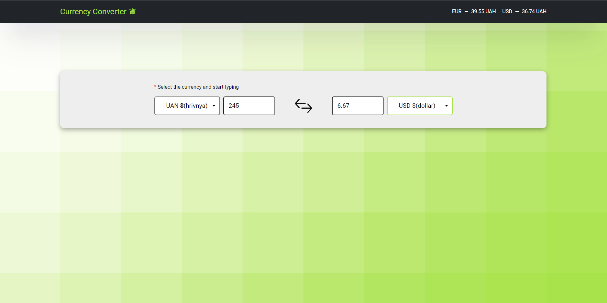

# AngularCurrencyTest

Tiny currency converter app built with angular.

## Before Developing

I uploaded "environment.ts" file to the repository with my api credentials for you to be able to serf the app. My free trial ends soon (June 21, 2023). As an API i used [XE currency API](https://www.xe.com/xecurrencydata/). If you want you can create your own acc and configure the envorinment file yourself.

You should have node installed, then just type:

```sh
npm i
```

## Development server

Run:

```sh
npm start
```

or

```sh
ng serve --open
```

Navigate to `http://localhost:4200/`. The application will automatically reload if you change any of the source files.

## Design Preview

There is only one main page for converting currencies:


